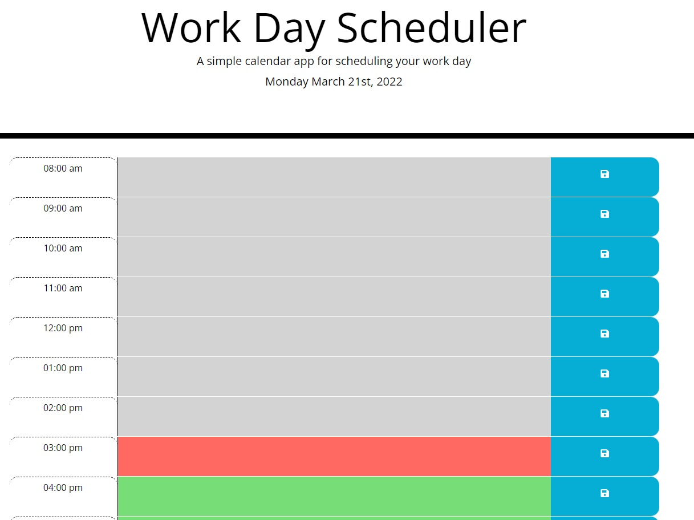

# homework-workday-schedule
Third assignment of Bootcamp

## Description

This is the Fifth assignment for the Bootcamp. DAY PLANNER was a good task to perform. i was able to collect ideas and information how and what to get done. Delegate is used and moment.js in order to calculate the time and format date and time.

This is pretty nice for day to day planner. We can add dateTimePicker and make it a bigger app.

It was nice to make the code and come up with ideas in order to use effective coding.

The layout of the index.html file was provided which made is quite easy to just write the javascript code.

I used the sample, provided in homework README and came up with my end result.

## Table of Contents

- [URL (deployed application)](#url)
- [URL (github repository)](#urlrepo)
- [Layout](#layout)
- [Credits](#credits)
- [License](#license)

## URL (deployed application)

Following is the url link to access the deployed application.

https://muradmanni.github.io/homework-workday-schedule/

## URL (github repository)

Following link is to access the code files using github repository.

https://github.com/muradmanni/homework-workday-schedule

## Layout
   

## Credits

I did some research using www.stackoverflow.com

## License

No license required.
